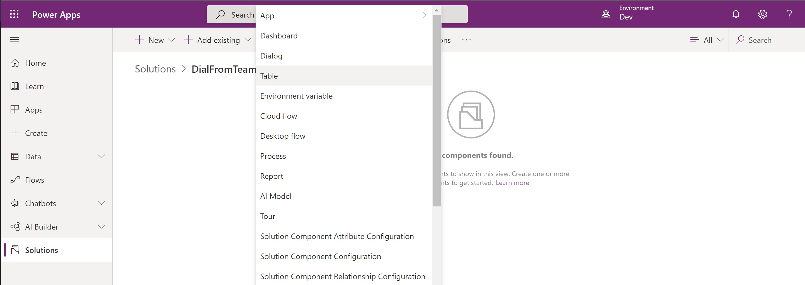
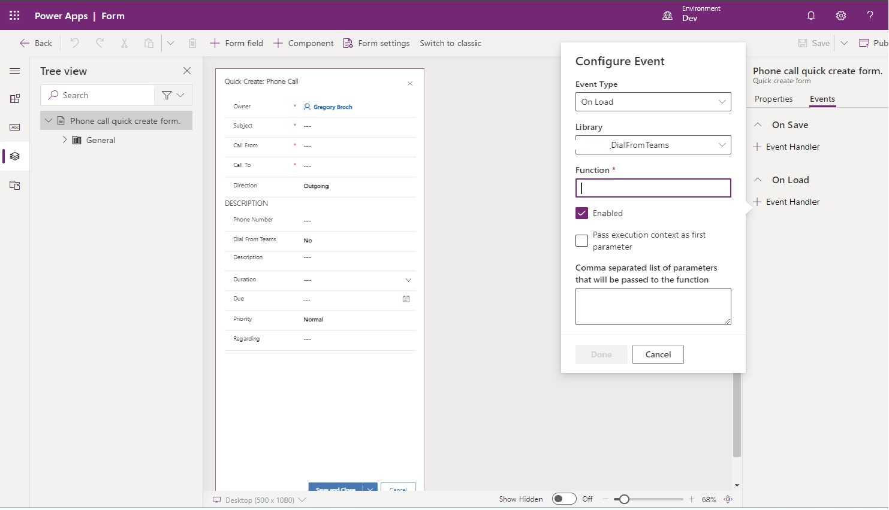

# Click To Dial From D365 or Model-driven Power Apps Using Teams

This sample shows you how to initiate Microsoft Teams outbound calling from either Dynamics 365 or Power Apps model-driven apps using MS Teams deep links. While most tenants can leverage the Teams native integrations in D365 apps, there may be scenarios where that capabilities have not yet been made available in your tenant.

> [!IMPORTANT]
> This solution requires that your users users assigned with Teams Calling Plan license and either [
model-driven Power Apps](https://docs.microsoft.com/en-us/power-platform/admin/powerapps-flow-licensing-faq#how-is-microsoft-power-apps-and-power-automate-licensed) or [
Dynamics 365 apps](https://www.microsoft.com/en-us/licensing/product-licensing/dynamics365).
   
## Solution Steps Overview

    * Create a new solution file
    * Add the Phone Call entity table to the new solution file, including the existing Quick Create form
    * Create a new custom field in the Phone entity table, of type Yes/No 
    * Update the javascript to reference the name of your custom field
    * Add the javascript file as a web resource in your solution file, then add the library to the Quick Create form's OnLoad properties
    * Add the new custom field to the Quick Create form, and assign the initiatePhoneCallWindow function to the OnChange event
    * Save and Publish All Customizations 

## Create a new solution file

From the [PowerApps Portal](https://make.powerapps.com/), create a new solution file in your environment.

## Add the Phone Call entity

From within your solution file, select "Add Existing" -> "Table".



Select the Phone Call entity


Click the option for "Select Components", click Forms, and select the "Quick Create" form.


## Add a custom column to the Phone Call

Within the solution file you created, select the Phone Call entity that you just added, and choose the option to add a column.
Note the developer prefix associated with your publisher, as you will need this in the following step. Set the data type to "Yes/No" so you can use the default dropdown or toggle controls.


## Update your javascript

The [Javascript Library](https://github.com/microsoft/Federal-Business-Applications/blob/main/demos/d365-click-to-dial-teams/files/DialFromTeams.js) will need to be updated to include your custom property.
Update the following line in the code, so that the name of your custom property is placed between the quotation marks.
 (The name should use the publisherPrefix_propertyName syntax)

```javascript
# var callFromTeams = formContext.getAttribute("").getValue();
```

## Add your javascript file as a web resource

With the solution file, select New->Other->Web Resource.


## Update the Quick Create form

Within your solution file, select the Quick Create form, and configure the OnLoad event of the form so that it references your javascript library



Place the new custom field on the form, and configure the OnChange event. Ensure that the "Pass execution context as first parameter" is checked. Then Save and Publish all customizations.


