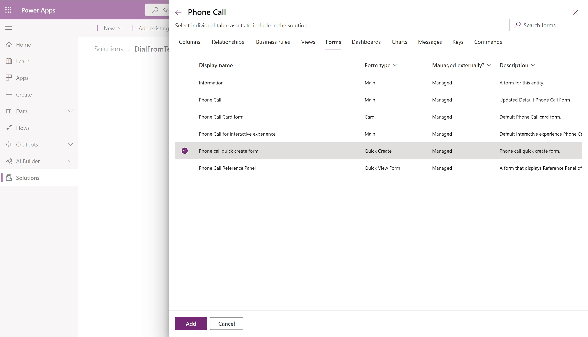
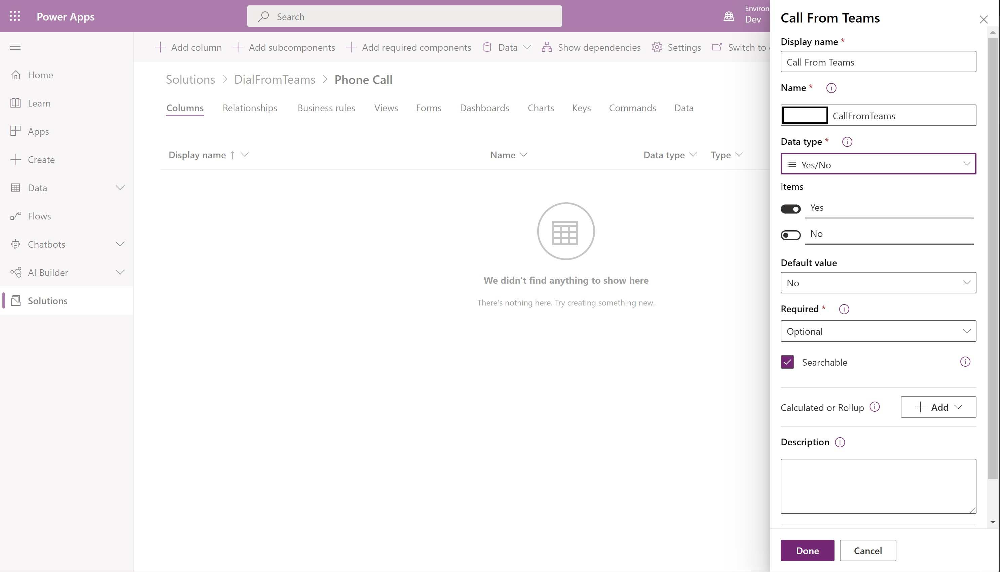
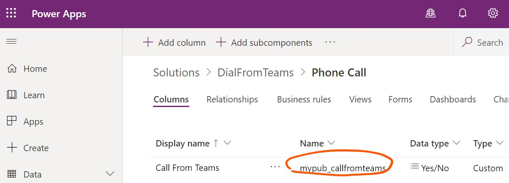
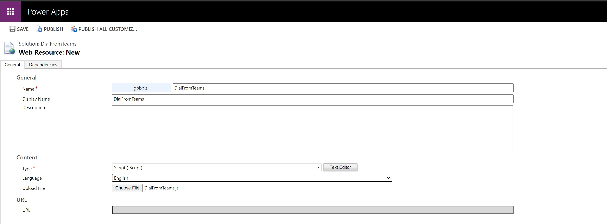
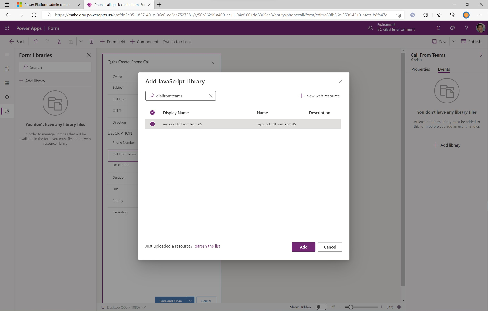
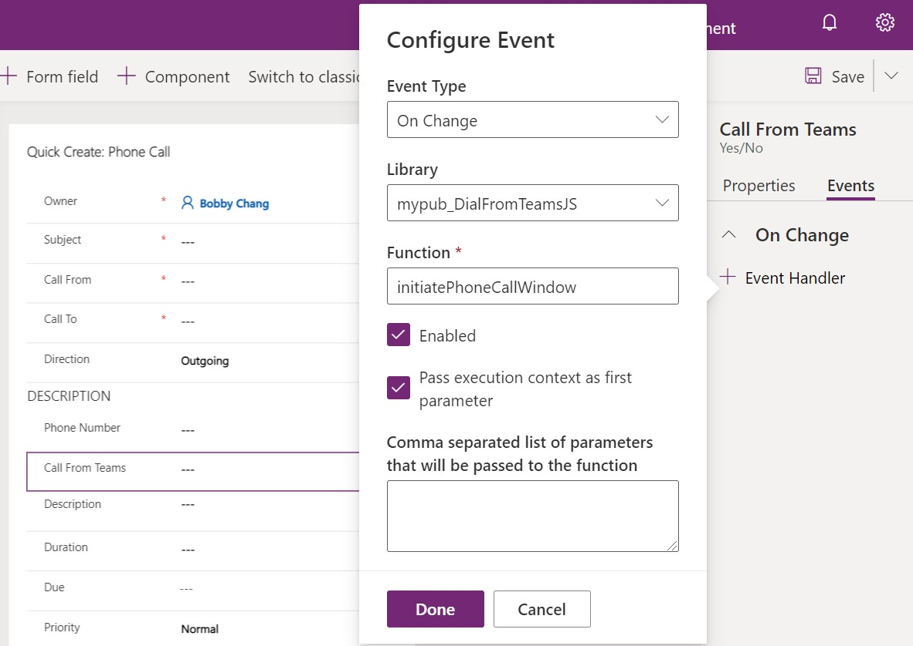
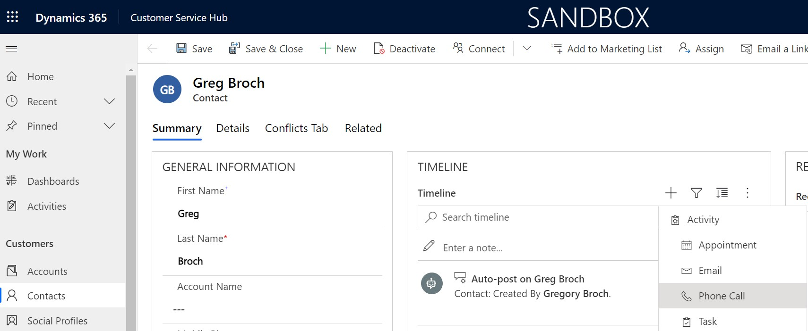
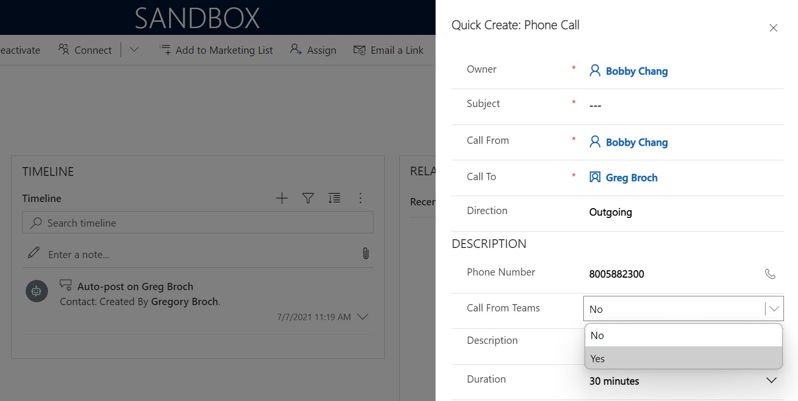

# Teams Click-To-Dial From D365 or Model-Driven Power Apps

This sample shows you how to initiate Microsoft Teams outbound calling from either Dynamics 365 or Power Apps model-driven apps using MS Teams deep links. While most tenants can leverage the Teams native integrations in D365 apps, there may be scenarios where that capabilities have not yet been made available in your tenant.

> [!IMPORTANT]
> This solution requires that your users users assigned with Teams Calling Plan license and either [
Dynamics 365 apps](https://www.microsoft.com/en-us/licensing/product-licensing/dynamics365) or  [
Model-Driven Power Apps](https://docs.microsoft.com/en-us/power-platform/admin/powerapps-flow-licensing-faq#how-is-microsoft-power-apps-and-power-automate-licensed).
   
## Solution Steps Overview

    * Create a new solution file
    * Add the Phone Call entity table to the new solution file, including the existing Quick Create form
    * Create a new custom field in the Phone entity table, of type Yes/No 
    * Update the javascript to reference the name of your custom field
    * Add the javascript file as a web resource in your solution file, then add the library to the Quick Create form's OnLoad properties
    * Add the new custom field to the Quick Create form, and assign the initiatePhoneCallWindow function to the OnChange event
    * Save and Publish All Customizations 

## Create a new solution file

From the [Power Apps maker portal](https://make.gov.powerapps.us/), [create a new solution file](https://docs.microsoft.com/en-us/powerapps/maker/data-platform/create-solution) in your environment.

## Add the Phone Call entity

From within your solution file, select "Add Existing" -> "Table".


Select the Phone Call entity


Click the option for "Select Components", click Forms, and select the "Quick Create" form.




## Add a custom column to the Phone Call

Within the solution file, select the Phone Call table that you have just added,then choose the option to add a column.
Note the developer prefix will be specific to your environment's publisher info (which you would need to reference in the following step). Set the data type to "Yes/No" so you can use the default dropdown or toggle controls.



Click Done.  Then click on "Save Table".

## Update your javascript

Download the script from this [Javascript Library](https://github.com/microsoft/Federal-Business-Applications/blob/main/demos/d365-click-to-dial-teams/files/DialFromTeams.js). 

Obtain your custom column name.  i.e., Column name should be in the publisherPrefix_propertyName syntax.



Update the following line in your Javascript file and paste your custom column name in between the quotation marks.

```javascript
# var callFromTeams = formContext.getAttribute("").getValue();
```

## Add your javascript file as a web resource

Save your Javascript file locally, then upload the file into the Power Apps solution file by selecting New->Other->Web Resource.




Click Save, then Publish.

## Update the Quick Create form

Within your solution file, click on Phone Call Table > Forms tab > Phone call quick create form.  

Add the custom column to your form.


Click on your custom column > Events tab -> Add library -> Search then add your DialFromTeams Javascript file



    * Click + Event Handler
    * Ensure that you select OnChange and your Javascript Library
    * In the Function textbox, type initiatePhoneCallWindow
    * Check "Pass execution context as first parameter"
    * Click Done



Save then Publish your form.

## See It in Action

Open a D365 app or a Model-Driven Power Apps.  Find a form that has the Timeline Control (typically found in the out-of-box Contact, Account, Case forms).  Click on + > Phone Call



Within the Quick Create: Phone Call form, type a Phone Number then change the Call from Teams value to Yes



If there's a pop-up from your browser to confirm opening up the call in Teams, click OK.  At this point, your Teams client app should be making the outbound phone call accordingly.


