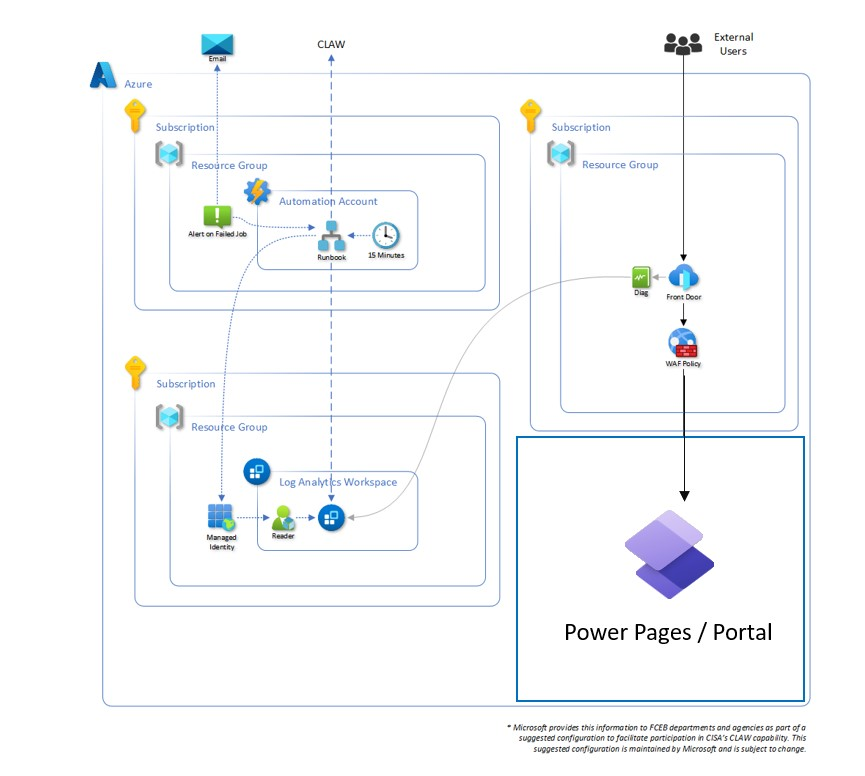

# Federal Security Resources for Microsoft Business Applications
The goal of this whitepaper is to have a single place to refer for US Federal security and accreditation resources for Power Platform and GCC.

# FedRAMP Packages
* [Azure Commercial FedRAMP Package](https://marketplace.fedramp.gov/#!/product/azure-commercial-cloud?sort=productName)
  * Includes only commercial Power Platform and D365 services
* [Azure for Government FedRAMP Package](https://marketplace.fedramp.gov/#!/product/azure-government-includes-dynamics-365?sort=productName)
  * Includes both GCC and GCC High environments for Power Platform and D365 services
* [Office 365 Multi-Tenant & Supporting Services](https://marketplace.fedramp.gov/#!/product/office-365-multi-tenant--supporting-services?sort=productName)
  * Office 365 GCC
* [Microsoft Office 365 GCC High](https://marketplace.fedramp.gov/#!/product/microsoft-office-365-gcc-high?sort=productName)
  * Office 365 GCC High
  
  
If you need to request any of the actual FedRAMP pacakges from Microsoft, please send a request to azurefedramp@microsoft.com.
  
 A visual diagram of our FedRAMP packages above for a GCC customer is shown below,
 
 

# CISA Recommended Security Baseline
CISA's Secure Cloud Business Appliations (SCuBA) official website can be found below,

[CISA SCuBA Official Page](https://www.cisa.gov/scuba)

CISA has published M365 Minimum Viable Secure Configuration Baseline documents for various Microsoft products.  Below is a link to the entire GitHub repository,

[SCuBA M365 Security Baseline Assessment Tool](https://github.com/cisagov/ScubaGear)

The security baseline recommendations Power Platform and Power BI can be found below,

* [Microsoft Power Platform M365 Minimum Viable Secure Configuration Baseline](https://github.com/cisagov/ScubaGear/blob/main/baselines/powerplatform.md)
* [Microsoft Power BI M365 Minimum Viable Secure Configuration Baseline](https://github.com/cisagov/ScubaGear/blob/main/baselines/powerbi.md)

# TIC for Internal Agency Use

For internal Agency use of Power Platform and D365, our services leverage the security and auditing capabilities of Microsoft 365.  We have a great blog series that outlines how Microsoft 365 services align to TIC.  The blog links can be found below,

* [Part 1 – Securing Mobile](https://devblogs.microsoft.com/azuregov/securing-mobile-designing-saas-service-implementations-to-meet-federal-tic-policy-1-of-4/)
* [Part 2 - Securing the Endpoint](https://devblogs.microsoft.com/azuregov/securing-the-endpoint-designing-saas-service-implementations-to-meet-federal-policy-2-of-4/)
* [Part 3 - Securing the Platform](https://techcommunity.microsoft.com/t5/public-sector-blog/securing-the-platform-designing-saas-service-implementations-to/ba-p/1192088)
* [Part 4 - Auditing and Logging](https://techcommunity.microsoft.com/t5/public-sector-blog/auditing-and-logging-designing-saas-service-implementations-to/ba-p/1550810)

# TIC for Public Facing Power Pages (i.e. Portals)

We recommend using Azure Front Door with Power Pages to support CISA TIC requirements.  Some of the benefits you get when using Azure Front Door with Power Pages are below,

* Support ````IPv6```` traffic
* Built in Web Application Firewall (WAF)
* Content Delivery Network (CDN) of static content in Power Pages
* Restrict Power Pages traffic to only coming through Azure Front Door

Below is a great resource on designing a web application to use Azure Front Door to meet TIC 3.0 requirements,

[TIC 3.0 Azure Front Door Architecture](https://github.com/haithamshahin333/Federal-App-Innovation-Community/tree/main/topics/infrastructure/solutions/tic3.0/Azure-Front-Door)

You can easily swap out the web application above with a Power Pages web application.  That design would look like this,



Below we have great documentation on how to configure a Power Pages Portal with Azure Front Door,

[Set up Azure Front Door with portals](https://learn.microsoft.com/en-us/power-apps/maker/portals/azure-front-door)

Lastly, you can also configure diagnostic logs from Power Pages to get sent to an Azure Storage account.


