# A Guide to Power BI Embedding within Government Community Clouds (GCC)

# Table of Contents

1. [Overview](#overview)

    1.1 [Common embedding scenarios](#common-embedding-scenarios)

    1.2 [Options for embedding Power BI reports](#options-for-embedding-power-bi-reports)

    1.3 [Embedding scenarios and options](#embedding-scenarios-and-options)

1. [General considerations for embedding](#general-considerations-for-embedding)

    2.1 [Security](#security)

    2.2 [App vs Workspace report embedding](#app-vs-workspace-report-embedding)

    2.3 [Consideration for App Report embedding](#consideration-for-app-report-embedding)

    2.4 [Consideration for embedding reports for large audience, including entire organization](#consideration-for-embedding-reports-for-large-audience-including-entire-organization)

1. [Embed in SharePoint Online](#embed-in-sharepoint-online)

    3.1 [Steps for embedding](#steps-for-embedding)

1. [Embed in Microsoft Teams](#embed-in-microsoft-teams)

    4.1 [Steps for embedding](#steps-for-embedding-1)

1. [Secure Embed (for internal portals)](#secure-embed-for-internal-portals)

    5.1 [Steps for embedding](#steps-for-embedding-2)

    5.2 [Customizing the Embedded Report](#customizing-the-embedded-report)

    5.3 [Rules](#rules)

    5.4 [Cookies](#cookies)

1. [Embed using Power BI REST APIs](#embed-using-power-bi-rest-apis)

    6.1 [Embedding for your organization (User owns data)](#embedding-for-your-organization-user-owns-data)

    6.2 [Embedding for your customer (App owns data)](#embedding-for-your-customer-app-owns-data)

1. [Embed using Publish to web (public)](#embed-using-publish-to-web-public)

1. [Appendix](#appendix)

    8.1 [Get the correct App URL](#get-the-correct-app-url)

    8.2 [Update Azure app registrations](#update-azure-app-registrations)

#  Overview

Power BI has built-in features to embed Power BI reports in any
application. Developers can add valuable visual analytics directly in
their application for end users. Embedding is supported on applications
like SharePoint, Microsoft Teams, Dynamics 365, or any custom web
application. There are different options for embedding, which will be
covered in this document. We will also explore common embedding
scenarios and the best approach for those scenarios.

>***Important Note:** This document includes embedding options for the Power BI
Service on US Gov Clouds* <https://app.powerbigov.us/>

-   [Power BI Embedded in
    Azure](https://docs.microsoft.com/en-us/power-bi/developer/embedded/azure-pbie-what-is-power-bi-embedded)
    is not covered in this document.

-   Embedding in Power BI Report Server (on premises) is covered in this
    article
    [here](https://docs.microsoft.com/en-us/power-bi/report-server/quickstart-embed).

## Common embedding scenarios

1.  Embed Power BI report in an internal application within your agency's network. All users will be internal users with \*.gov email address.

2.  Embed Power BI report in an external application accessible outside the your agency's network. Users may or may not have a \.gov email address. Optionally, users may not even be required to authenticate (anonymous access).

3.  Embed Power BI report in a public facing external website. Any user can access the report anonymously.

## Options for embedding Power BI reports

1.  **Embed in SharePoint Online**

    This option provides direct integration with SharePoint Online sites. With this type of embedding, Power BI embeds the report as a web part in a SharePoint Online page. This is a no-code embedding option and is the recommended approach for embedding Power BI reports in SharePoint Online. ***Note: This approach will work only with SharePoint Online.***
    
    Additional details covered [here](#embed-in-sharepoint-online).

2.  **Embed in Microsoft Teams**

    Microsoft Teams has native integration with Power BI. You can easily add new Power BI report tabs to Teams channel in a few clicks. This option essentially adds Power BI reports where people collaborate, encouraging data driven decision making.
    
    Additional details covered [here](#embed-in-microsoft-teams).

3.  **Secure Embed (a.k.a. Website or portal embed)**

    With the Secure Embed option (also referred to simply as the 'Embed' option) for Power BI reports, you can easily and securely embed reports in internal web portals. Embedded reports respect all item permissions and data security. This provides no-code embedding into any portal that accepts a URL or iFrame. The Embed option supports URL Filters and URL settings. It allows you to integrate with portals using a low-code approach requiring only basic HTML and JavaScript knowledge.
    
    Additional details covered [here](#embed-in-sharepoint-online).

4.  **Embed using Power BI REST APIs**

    The Power BI service (SaaS) has APIs for embedding your dashboards and reports. Embedding using REST APIs gives you more granular control on all aspects of embedding unlike the Secure Embed option. You will need to work with administrators to enable this feature for your project.

    This approach can be used for embedding in internal applications as well as for external applications, including public websites.Embedding for internal application is commonly referred to as 'User owns data' (embed content for your organization). Embedding for external application is commonly referred to as 'App owns data' (embed content for your external customers).

    Additional details covered [here](#embed-using-power-bi-rest-apis).

5.  **Publish to web (public)**

    With the Power BI Publish to web option, you can easily embed interactive Power BI visualizations online, such as in public websites. You can also easily edit, update, refresh, or stop sharing your published visuals.

    This option provides users anonymous access to the embedded report and bypasses Power BI security. As such, this is less secure than other embedding options. You will need to work with an administrator to use this feature. *{ADMIN NOTE: This should be disabled by default in the tenant settings}*

    Additional details covered [here](#embed-using-publish-to-web-public).

## Embedding scenarios and options

|   | Embed in SharePoint Online  | Secure Embed  | Embed using Power BI REST APIs  | Publish to Web  |
|---|---|---|---|---|
| Embed in internal applications/portals  | X¹ (recommended for SPO)  |  X (recommended)  | X²  |   |
| Embed in external applications  |   |   | X (App owns data scenario)  |   |
| Embed in public websites  |   |   | X (App owns data scenario)  | X |

¹ Embedding works ONLY on SharePoint online sites.*

² Power BI Rest API using 'User owns data' is a good alternative to
'Secure Embed' for embedding reports in internal application. 'User owns
data' approach uses Power BI security and each user programmatically
authenticates using their access token. 'App owns data' can also be used
in this scenario. However, this approach will use a single fixed account
or service principal for authentication (like a proxy).*

# General considerations for embedding

## Security

Note that embedded reports are secured in the Power BI Service. Power BI gives different options for sharing reports -- direct report sharing, sharing via Workspace Access, and sharing via Apps. If a user does not have access to a report in Power BI Service, they will not be able to view this report if it is embedded in SharePoint or any other portal.

So, the first step in embedding is to provide access to the report in Power BI Service.

## App vs Workspace report embedding

Reports embed URLs can be generated either from a Workspace or the
corresponding App. The option you would choose will depend on how the
report is shared with end users in Power BI. If you [share the report
directly](https://docs.microsoft.com/en-us/power-bi/collaborate-share/service-share-dashboards)
with users or give access to the report using [Workspace
access](https://docs.microsoft.com/en-us/power-bi/collaborate-share/service-new-workspaces#roles-in-the-new-workspaces),
you should generate the embed link from the Workspace. If you [share
your report using an
App](https://docs.microsoft.com/en-us/power-bi/collaborate-share/service-create-distribute-apps),
you should generate the embed code from the App.

-   To get **Workspace Report** embed link, navigate to the report from
    the workspace and then go to *Share > Embed report*

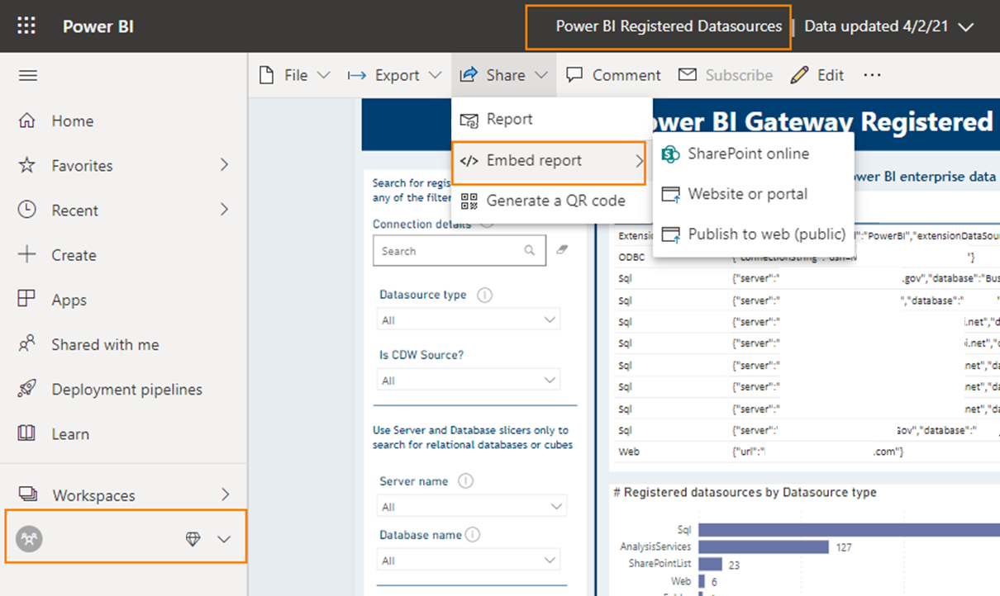

-   To get **App Report** embed link, navigate to the App, open the
    report inside the App and then go to *Share > Embed report*

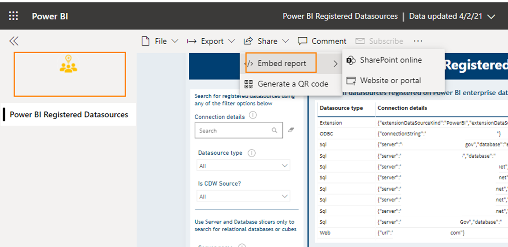
## Consideration for App Report embedding

A user will be able to view an embedded App report only if the App is installed for that user. Adding the user account to the App permission alone is not sufficient. If the App is not installed, the embedded page will throw errors as shown below.

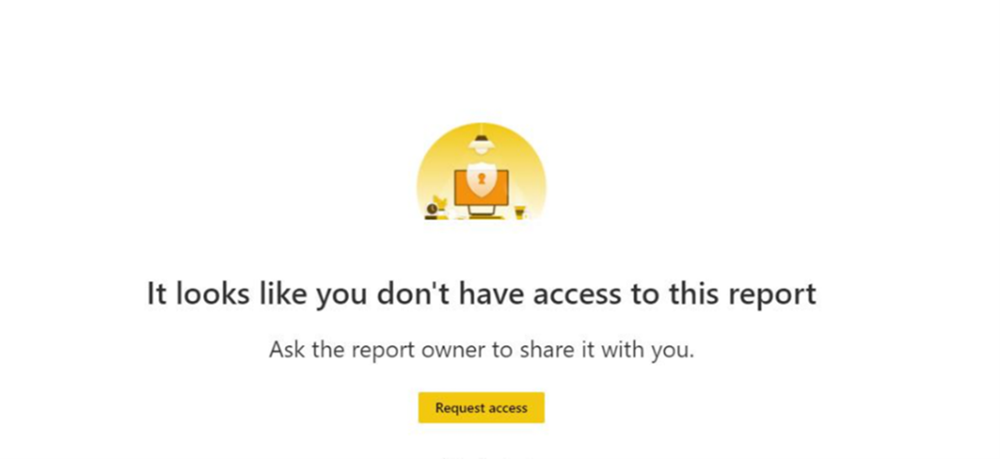
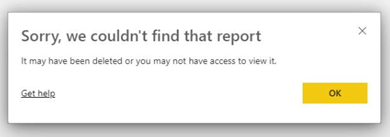

An App can be installed in the following ways.

1.  When user opens the **direct App URL** for the first time, it will
    get installed automatically for that user. This is the easiest and
    the recommended approach. App owner is advised to share the App URL
    with the end uses. Check [appendix](#get-the-correct-app-url) for
    the steps to get the correct App URL.

2.  User can search for the App in the AppSource using **Get apps** and
    then install the App. More details
    [here](https://docs.microsoft.com/en-us/power-bi/consumer/end-user-app-view).

3.  [Install App
    Automatically](https://docs.microsoft.com/en-us/power-bi/collaborate-share/service-create-distribute-apps#automatically-install-apps-for-end-users)
    -- this feature is currently disabled *{ADMIN NOTE: This should be disabled by default in the tenant settings}*. If an App owner wishes to use this feature, please contact *{ADMIN NOTE: Please insert contact email}*.

## Consideration for embedding reports for large audience, including entire organization

We recommend the following options if your embedded reports will be shared with large groups of users.

**Option 1** (recommended)

Give access to your report by [sharing the report
directly](https://docs.microsoft.com/en-us/power-bi/collaborate-share/service-share-dashboards)
with users from the workspace. You can share the report with an individual user or a Security Group. You can use security groups to share with large groups of users including all agency users. Generate the embed URL for the report from the workspace. Use the embed link to embed
in your website. With this option, we are not using an App.

**Option 2**

This option uses App for embedding. Report is shared with users via an App and the embed URL is generated from the App report. Note that the App will need to be installed for the users first. Check [Special
consideration for App Report
embedding](#consideration-for-app-report-embedding).

"Install App Automatically" is not recommended for Apps shared with large audiences. So, we suggest that you add the URL to your App on the embedded page with a note to the effect of -- *"Click here \<app URL> to get access to the embedded report."* Note that this needs to be done
only once by the user. When a user opens an App (clicks App URL) for the first time, the App is installed for their account.

To find your App URL check this [section](#get-the-correct-app-url).

# Embed in SharePoint Online

With Power BI\'s report web part for SharePoint Online, you can easily embed interactive Power BI reports in SharePoint Online pages. When using the Embed in SharePoint Online option, the embedded reports are
fully secure, so you can easily create secure internal portals. This option works with SharePoint Online and is the recommended approach for embedding in SharePoint Online. Note that this provides a proper single sign-on experience, which is missing in the [Secure
Embed](#secure-embed-for-internal-portals) approach. Additionally, you don't have to add Power BI URLs to the allowed cookies in client browsers with this option.

Detailed instructions
[here](https://docs.microsoft.com/en-us/power-bi/collaborate-share/service-embed-report-spo).

## Steps for embedding

1.  Get report URL. From the Power BI Service (https://app.powerbigov.us) open the report and go to **Share > Embed report > SharePoint Online**.


>
> ***Important Note**:* *Embed code generated for a report in a Workspace is different from the embed code generated for the same report inside the corresponding App. Keep in mind that a Workspace and an App have different security definitions. Typically, we share reports via Apps; so make sure to generate the embed code for your report from the App. Read
[rules](#rules) section for more details.*

2.  Embed report to a SharePoint Online page
-   Open/create a page in SharePoint Online.
-   Select the + dropdown and then select the Power BI web part.


> ***Important Note**: Use the Power BI web part.*
-   Add the report using the URL copied above.

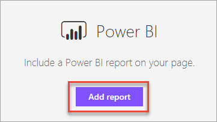


> ***Important Note**:* *If you are embedding a report from an App shared with the entire organization, please read [this](#_Special_consideration_for).*

# Embed in Microsoft Teams

Measuring and tracking results is essential for teams to achieve their objectives. However, it's often hard for everyone to use data to make decisions. Adding Power BI reports where people collaborate helps data driven decision making become part of your routine. The new tab adds support for reports in the new workspace experiences, reports in Power BI apps, and paginated reports.

Read more about this feature
[here](https://powerbi.microsoft.com/en-us/blog/announcing-new-power-bi-tab-for-microsoft-teams/).

## Steps for embedding

1.  Go to your Team in the Teams app and click **Add a tab**.

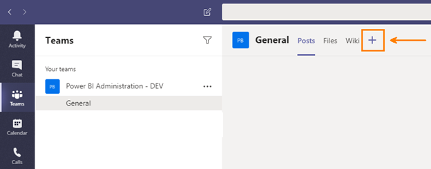

2.  Select **Power BI** tab.


3.  Give a friendly name for the tab, select your workspace from the dropdown and pick the report you want to embed from the list. You may, optionally, post a message about this new tab to the Team channel. Click **Save.**

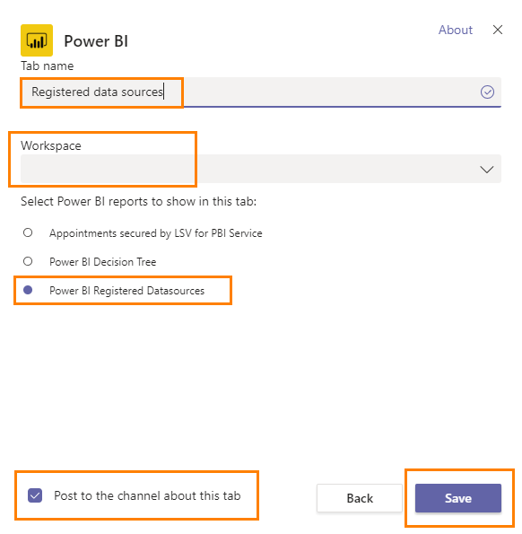

4.  That's it! You will see a new tab with the embedded report in your Teams channel. You may add additional Power BI report tabs to the channel. The embedded report is interactive and will automatically refresh based on the underlying dataset's refresh schedule.
> ***Note** that you can click the globe icon on the top right corner to open the report in Power BI Service.*


# Secure Embed (for internal portals)

[Secure
Embed](https://powerbi.microsoft.com/en-us/blog/easily-embed-secure-power-bi-reports-in-your-internal-portals-or-websites/) is an easy way to show Power BI Reports in internal websites, without the need for coding Additional details [here](https://docs.microsoft.com/en-us/power-bi/service-embed-secure). This approach can be used to easily embed Power BI reports securely on
SharePoint Online, Dynamics 365 and more.

*Note that this option may not work with on-premises SharePoint due to current security settings on your laptop/device, please see the details in the [Cookies
section](#cookies).*

## Steps for embedding

> ***Note**: "Secure Embed" is a valid embedding option for SharePoint Online; however, you may want to first check the [Embed in SharePoint Online](#embed-in-sharepoint-online) option. Furthermore, secure embed has a tendency to timeout after 20-30 minutes and therefore will prompt you to re-sign into Power BI. Consider this option carefully if the use case involves prolonged use the Power BI.*

Since SharePoint Online is a common use case the following instructions will show how to embed a Power BI Report in a SharePoint Online page.

1.  Navigate to the report on the Power BI Service. If you are trying to embed a report published through an App, you will need to navigate to the report WITHIN the App.

2.  Click on the "Share" option in the menu and select the "Embed
    report > Website or portal" option.


> ***Important Note**:* Embed code generated for a report in a Workspace is different from the embed code generated for the same report inside the corresponding App. Keep in mind that a Workspace and an App have different security definitions. Typically, we share reports via Apps; so, make sure to generate the embed code for your report from the App. Read [rules](#rules) section for more details.*

3.  A window will appear (see image below) that provides the option to copy a URL (the first option) or copy the HTML. The second option (HTML) is preferable as it has the additional code to allow for embedding in a SharePoint site or another web application.


4.  Copy the HTML to Notepad as save the file as ```EmbedReport.txt```


5.  Now navigate to your SharePoint site. In this example we are using SharePoint Online so we will be using the modern experience as this will be the more common experience set by Microsoft moving forward. 

> ***Important Note**: You will need at least Design rights to the site to do the next steps. If you are a Site Owner or have been given Full Control to the site, this will also work.***

6.  Go to Site Contents of your SharePoint site and select the "New" button and then select the Page option.

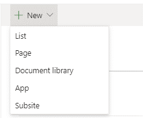

7.  You will be presented with a new page where it says, "Name your page", add an appropriate title.

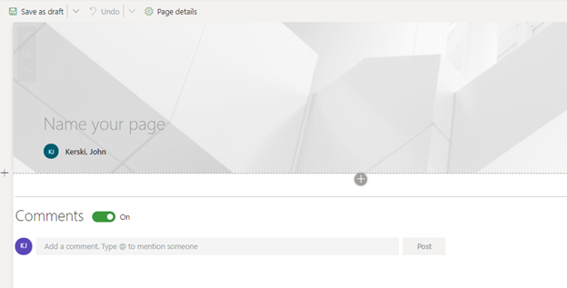

8.  Then click the "+" icon and select the Embed option.

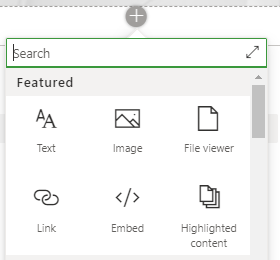

9.  A side-panel will appear (see Figure 6)

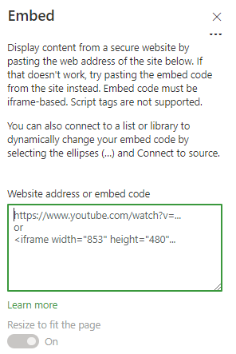

10. Paste the code you saved from ```EmbedReport.txt``` into the text area field labeled "Website address or embed code".


11. If pasted correctly the report should appear.


12. Make sure to either press the button "Save to Draft" or "Publish" to save your changes. Note that "Save to Draft" will only make changes visible to you.

Once you embed the report, please read the section on [Rules](#rules) to ensure that others can view the report as well.

> ***Important Note**: If you are embedding a report from an App shared with entire organization, please read [this](#_Special_consideration_for).*

## Customizing the Embedded Report

If you want to further customize how the embedded report is displayed, please see these tips:

### Tip #1 - Hide Tabs in the Report

Add the bolded code below to the embed code to hide the tabs. 

>\<iframe width=\"1140\" height=\"541.25\"
src=\"https://app.powerbigov.us/reportEmbed?reportId=xXb43542-81e5-4869-8571-014e47d59084&autoAuth=true&ctid=f5727296-5b49-4b31-a544-d1d85d64a529&config=xxxxxxVzdGVyVXJsIjoiaHR0cHM6Ly93YWJpLXVzLWVhc3QyLXJlZGlyZWN0LmFuYWx5c2lzLndpbmRvd3MubmV0LyJ9 **&navContentPaneEnabled=false**\"
frameborder=\"0\" allowFullScreen=\"true\"\>\</iframe>


### Tip #2 - Hide Filter Pane from Report

Add the bolded code below to the embed code to hide the filter pane. 

>\<iframe width=\"1140\" height=\"541.25\"
src=\"https://app.powerbigov.us/reportEmbed?reportId=xXb43542-81e5-4869-8571-014e47d59084&autoAuth=true&ctid=f5727296-5b49-4b31-a544-d1d85d64a529&config=xxxxxxVzdGVyVXJsIjoiaHR0cHM6Ly93YWJpLXVzLWVhc3QyLXJlZGlyZWN0LmFuYWx5c2lzLndpbmRvd3MubmV0LyJ9 **&filterPaneEnabled=false**\"
frameborder=\"0\" allowFullScreen=\"true\"\>\</iframe>


### Tip #3 - Choose which tab of the report to display

Please follow these steps:

1. In the Power BI Service, go the report and select the tab for the report you wish to show by default.

2. In the URL copy the text after the last forward slash character. For example the text after the last forward slash below would be the text: ```ReportSection2f16bbfdbd93add9c47f```.


3. Add the highlighted code below to the embed code using what you copied in step 2.

>\<iframe width=\"1140\" height=\"541.25\"
src=\"https://app.powerbigov.us/reportEmbed?reportId=xXb43542-81e5-4869-8571-014e47d59084&autoAuth=true&ctid=f5727296-5b49-4b31-a544-d1d85d64a529&config=xxxxxxVzdGVyVXJsIjoiaHR0cHM6Ly93YWJpLXVzLWVhc3QyLXJlZGlyZWN0LmFuYWx5c2lzLndpbmRvd3MubmV0LyJ9 **&pageName=
ReportSection2f16bbfdbd93add9c47f**\" frameborder=\"0\"
allowFullScreen=\"true\"\>\</iframe>


## Rules

To allow people to access an embedded report you will need to have the right security permissions established. This will depend on where the report is located.

### App Hosted Report

If the report is located within a Published App on your workspace then please follows these rules:

#### Licenses

1. If the workspace is not on Power BI Premium (if you don't see a diamond next to your workspace name, then you're not on Premium), each consumer of an embedded report will need a Power BI Pro License.

#### Permissions

2. A consumer of a report needs to have been given either explicit access (by name) in the Access settings of the App, or the consumer of the report is within an Active Directory Security Group that is identified in the Access settings of the App, or the Access settings of the App has the "Entire Organization" option selected. The image below provides a screenshot of the Access setting of an App for reference. *{ADMIN NOTE: This should be disabled by default in the tenant settings}* Please contact *{ADMIN NOTE: Please insert contact email}* for additional information and support.

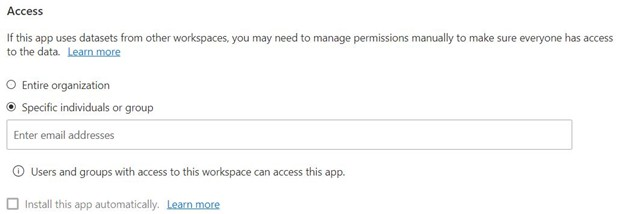


3. If the dataset used by the report is located on a different workspace, those accessing the embedded report must have access to the dataset's workspace.
    - Providing someone a Viewer role to the workspace is the minimum required permission.


### Workspace Hosted Report

If the report is located within a workspace and you are not using an App, then please follow these rules:

#### Licenses

1. If the workspace is not on Power BI Premium, each consumer of an embedded report will need a Power BI Pro License.

#### Permissions

2.  Those accessing the embedded report must have access to the report's workspace.
    - Providing someone a Viewer role to the workspace is the minimum required permission.

3.  If the dataset used by the report is located on a different workspace, those accessing the embedded report must have access to the dataset's workspace.
    - Providing someone a Viewer role to the workspace is the minimum required permission.

## Cookies

If you are embedding a Power BI Report on your website or on-premise SharePoint site, a third-party cookie (from Microsoft) is required to handle the Sign-In. More specifically secure embed relies on cookies for both <https://login.microsoftonline.com> and <https://app.powerbigov.us>. Consequently, embedding with on-premise applications (including on-premise SharePoint) will ONLY work if that on-premise application is moved into the same security zone within Internet Options. This requires Group Policy updates and will not be made unless there are extenuating circumstances. A workaround is to use Chrome for viewing embedded reports within on-premise applications.  This workaround needs to be done on each person's device to view embedded reports. *{ADMIN NOTE: Discuss with your Group Policy Administrator about allowing these cookies by default.}*

### Adding Allowed Cookies to Chrome

If you experience issues with viewing embedded Power BI Reports in Chrome, please check the following:

1.  Open Chrome and paste this link in the URL window
    <chrome://settings/content/cookies>.

2.  Scroll down the settings page until you see the "Allow Cookies" section and click add.


3.  A pop-up will appear. Paste ```[*.]login.microsoftonline.com``` into the textbox and click Add.

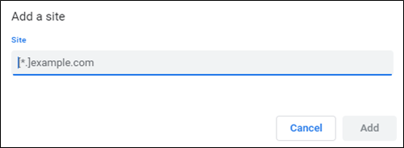

4.  Repeat Step 3 with the URL ```[*.]app.powerbigov.us```. Once completed you should see the following entries in the Allowed Cookie list (note they may not be next to each other).

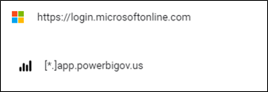


5.  Go to your embedded report in Chrome and verify you can see the report.

# Embed using Power BI REST APIs

The Power BI service (SaaS) has APIs for embedding your dashboards and reports. When embedding content, this gives you access to the latest Power BI features such as dashboards, gateways, and workspaces. More details covered in the Power BI public documentation site [here](https://docs.microsoft.com/en-us/power-bi/developer/embedded/embedding).

> ***Important Note**: Most of the Power BI online documentation for embedding refers to commercial cloud. Make sure to update your code to use the correct URLs for US Gov cloud. This user guide includes information relevant to the US Gov cloud and should be your primary source for guidance for
Power BI embedding at the US Gov Cloud.*

There are two main approaches to embedding using APIs.

1.  **Embedding for your organization (User owns data)**

This type of embedding requires your application\'s users sign into the Power BI service to view the content. Once someone in your organization signs in (using \*.gov account), they only have access to dashboards and reports that they own or that someone shared with them in the Power BI service. Organization embedding examples include internal applications such as SharePoint Online, Microsoft Dynamics and more.

Keep in mind that you can achieve similar results using the much
easier [Secure Embed](#secure-embed-for-internal-portals) option. Make sure to check if Secure Embed meets your requirement. If not, explore this API approach. Embedding using APIs gives more granular control on all aspects of embedding including designing a true Single Sign-On experience in your application.

2.  **Embedding for your customer (App owns data)**

This approach lets you embed dashboards and reports for users who may or may not have an \*.gov account to sign-in to Power BI Service. Instead, you will use a proxy account or service principal to authenticate all users to the Power BI Service. Because of these constraints, you will need to *{ADMIN NOTE: Please insert contact email}* for support and additional permissions.

Common use cases for this approach:
-   Embedding on public website. This can also be achieved using the Publish to web feature, which is much easier to implement. However, API based approach gives more granular control in embedding. Here's an example of this feature used at the Veterans Affairs -
    <https://www.accesstocare.va.gov/Healthcare/HospitalCompareData?s=AL&f=679&m=FLU>

-   Embedding on an external application that can be accessed by non-agency users.

-   Embedding on internal application, which is accessed only by agency users (\*.gov email). We recommend using [Secure Embed](#secure-embed-for-internal-portals) or [Embedding for your
    Organization (User owns data)](#embedding-for-your-organization-user-owns-data), in that
    order, for this scenario. However, there could be complex
    architecture and security requirements for your project, which may warrant using this approach.

> ***Important Note**: Both the embedding approaches using APIs will require administrator assistance. Detailed steps for embedding using REST APIs included in the respective
sections below.*

## Embedding for your organization (User owns data)

You can embed reports (Power BI or Paginated), dashboards, or tiles into an application by using user owns data. User owns data lets your application extend the Power BI service so it can use embedded analytics.

> ***Important Note**: This guide is customized to Power BI for US Government environment. Please follow this guide carefully to set up 'user owns data' embedding. You may follow the tutorial [here](https://docs.microsoft.com/en-us/power-bi/developer/embedded/embed-sample-for-your-organization) but keep in mind that the references in that tutorial points to the commercial cloud.*

### Prerequisites

-   Power BI Pro account. If you do not have Pro license, you may request one *{ADMIN NOTE: Please insert contact email}*

-   Power BI app workspace and report for embedding. Make sure your workspace is in Premium capacity if the consumers of your embedded report will not have Pro license. You may request Premium access *{ADMIN NOTE: Please insert contact email}*

-   Correct security permissions on your workspace/app or report. Please refer the [Rules](#rules) section.

At a high level, following are the steps to complete this process.

1.  Register an application in Azure Active Directory

2.  Contact administration *{ADMIN NOTE: Please insert contact email}*

3.  Embed Power BI report in your application

### 1. Register an application in Azure Active Directory

Use the App registration tool to register an app for Power BI Embedded on Azure AD.

1.  Navigate to the URL: [https://app.powerbigov.us/apps](https://app.powerbigov.us/apps)

2.  Sign in using your \*.gov account.


3.  Complete registration by entering the following.

-   **Application Name** will be used to identify your Azure App on Azure Active Directory.

-   **Application Type** should be 'Server-side web application'.

-   **Home Page URL**

-   **Redirect URL** should be the URL where users will be redirected upon sign in, so your application can receive an authorization code.


4.  Select the following APIs (check screenshot below) and click register. If you need access to additional APIs or make any changes, you may do so after the registration from the Azure AD portal. Please refer [Appendix](#appendix) on how to make updates to your Azure app after the initial registration.


4.  Make a note of the Application ID and Application secret. You will need the Application ID on the LEAF request. Application Secret will be used in your embedded application config file.


> *Application ID: xxxxxxx*
>
> *Application secret: xxxxxxxx*

At this point, you have registered the Azure App. However, note that the app is not yet enabled to be used in the agency's tenant.

### 2. Contact Administrator

Email *{ADMIN NOTE: Please insert contact email}*

You will need the following information in the request:

-   Application Name (from previous step)

-   Application ID (from previous step)

-   Power BI App Workspace name

-   Power BI App Workspace ID. You can get the Workspace id from the URL. For example the ```xxx67dd9-59d3-4d9d-8x1a-a25x761xd330``` GUID of the URL is the Workspace ID: 

```https://app.powerbigov.us/groups/xxx67dd9-59d3-4d9d-8x1a-a25x761xd330/list/dashboards```

You may be asked to provide additional details about your project including business justification or ATO. Please contact *{ADMIN NOTE: Please insert contact email}* for any questions. Once approved, your Azure app will be granted admin consent on the agency's tenant.

### 3. Embed Power BI report in your application

-   You may use the [User Owns Data
    samples](https://github.com/Microsoft/PowerBI-Developer-Samples) to
    test your embedded solution.

-   Make sure to update the web.config (or cloud.config) to match your app and the US Gov cloud URLs.

If you are using the sample code, update the keys in the config file as below.

`<add key=" AADAuthorityUri" value="https://login.microsoftonline.com/common/" />`
`<add key=" PowerBiAPIResource" value="https://analysis.usgovcloudapi.net/powerbi/api" />`
`<add key=" PowerBiDataset" value="https://api.powerbigov.us/ v1.0/myorg/" />`
`<add key=" PowerBiApiUrl" value="https://app.powerbigov.us" />`

-   Get the app id, workspace id and report id.

> - [Application
> ID](https://docs.microsoft.com/en-us/power-bi/developer/embedded/embed-sample-for-your-organization#application-id)
>
> - [Workspace
> ID](https://docs.microsoft.com/en-us/power-bi/developer/embedded/embed-sample-for-your-organization#workspace-id)
> - [Report
> ID](https://docs.microsoft.com/en-us/power-bi/developer/embedded/embed-sample-for-your-organization#report-id)
> (optional)

-   Please refer to the following documentation for more details on the steps for embedding Power BI content within your application code: https://docs.microsoft.com/en-us/power-bi/developer/embedded/embed-sample-for-your-organization#embed-your-content-within-your-application

> ***Important Note**: Ensure that the application client secret is not saved on the client-side code, for e.g. when using JavaScript. It should always be secured on server side.*

For more information about JavaScript API, reference [Power BI JavaScript API](https://github.com/Microsoft/PowerBI-JavaScript).

For a full sample of using the JavaScript API, you can use the [Playground tool](https://microsoft.github.io/PowerBI-JavaScript/demo). The Playground tool is a quick way to play with different types of Power BI Embedded samples. You can also get more Information about the
JavaScript API by visiting the [Power BI JavaScript wiki
page](https://github.com/Microsoft/powerbi-javascript/wiki).

## Embedding for your customer (App owns data)

You can embed reports (Power BI or Paginated), dashboards, or tiles into an application by using app owns data.

***Important Note:** This guide customized to Power BI for US Government environment, used at the agency. Please follow this guide carefully to set up 'app owns data' embedding. You may follow the tutorial
[here](https://docs.microsoft.com/en-us/power-bi/developer/embedded/embed-sample-for-customers)
but keep in mind the references point to commercial cloud. Feel free to also refer the tutorial to [Embed a Power BI content into your application for national
clouds](https://docs.microsoft.com/en-us/power-bi/developer/embedded/embed-sample-for-customers-national-clouds).*

### Prerequisites

-   Power BI Pro account. If you do not have Pro license, you may request one by contacting *{ADMIN NOTE: Please insert contact email}*

-   Power BI app workspace and report for embedding. Make sure your workspace is in a Premium workspace. You may request Premium access by contacting *{ADMIN NOTE: Please insert contact email}*

At a high level, following are the steps to complete this process.

1.  Register an application in Azure Active Directory

2.  Create a service principal

3.  Contact the administrator

4.  Add the service principal to your workspace

5.  Embed Power BI report in your application

Note that Power BI supports two options for authentication in an app owns data embedding scenario -- using master account (proxy account with
Pro license) or using Service Principal. 
> ***Important Note:* Only a Service Principal is supported at the agency**. *{ADMIN NOTE: Please update if this policy is different.}*

### 1. Register an application in Azure Active Directory

Use the App registration tool to register an app for Power BI Embedded on Azure AD.

1.  Navigate to the URL: [https://app.powerbigov.us/apps](https://app.powerbigov.us/apps)

2.  Sign in using your \*.gov account.


3.  Complete registration by entering the following.

-   **Application Name** will be used to identify your Azure App on Azure Active Directory.

-   **Application Type** should be 'Server-side web application'.

-   **Home Page URL**

-   **Redirect URL** should be the URL where users will be redirected upon sign in, so your application can receive an authorization code.


4.  Select the following APIs (check screenshot) and click register. If you need access to additional APIs or make any changes, you may do so after the registration from the Azure AD portal. Please refer [Appendix](#appendix) on how to make updates to your Azure app.

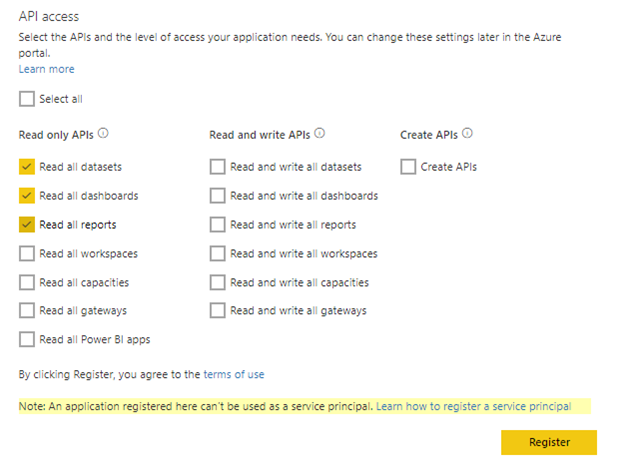

5.  Make a note of the Application ID and Application secret. You will need to provide the Application ID on requests to an administrator. Application Secret will be used in your embedded application config file.


> *Application ID: xxxxxxx*
>
> *Application secret: xxxxxxxx*

### 2. Create a service principal

1.  Navigate to the URL: <https://portal.azure.com/> and select "Azure Active Directory" in the navigation bar.


 

2.  Go to App Registrations and select Owned Applications

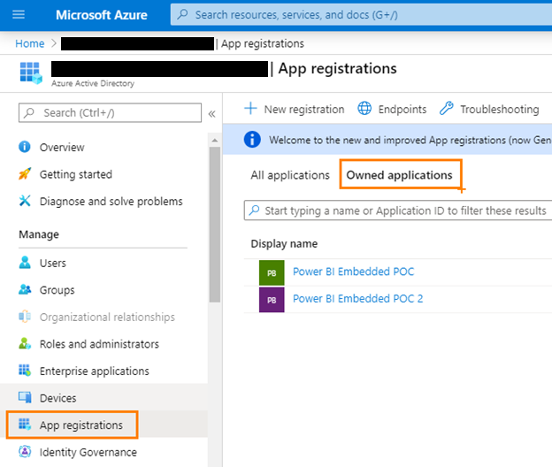 

3.  Click on the App you created in the previous step. and then click the link labeled "Create Service Principal"
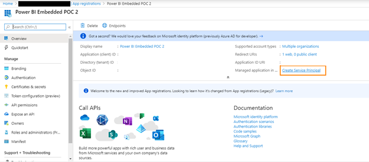 

4. At this point, you have registered the Azure App and set up an associated Service Principal. However, note that the app service principal is not yet enabled to be used in the agency's tenant.  

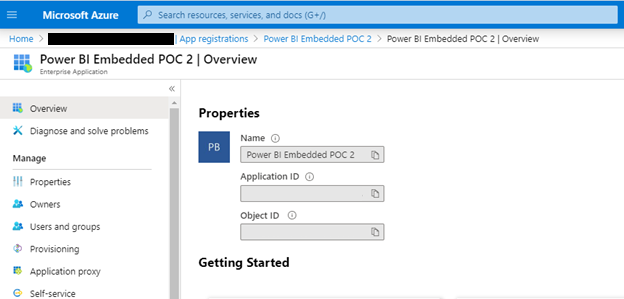

 
### 3. Contact Administrator

Email *{ADMIN NOTE: Please insert contact email}*

You will need the following information in the request:

-   Application Name (from previous step)

-   Application ID (from previous step)

-   Power BI App Workspace name

-   Power BI App Workspace ID. You can get the Workspace id from the URL. For example the ```x6x67dx9-5xx3-4d9d-8dxa-a25x761xx330``` GUID of the URL is the Workspace ID: 

```https://app.powerbigov.us/groups/x6x67dx9-5xx3-4d9d-8dxa-a25x761xx330/list/dashboards```

You may be asked to provide additional details about your project including business justification or ATO. Please contact *{ADMIN NOTE: Please insert contact email}* for any questions. Once approved, your Azure app
will be granted admin consent on the agency's tenant.

### 4. Add the service principal to your workspace

To enable your Azure AD app access artifacts such as reports, dashboards, and datasets in the Power BI service, add the service principal entity as a member or admin to your workspace. Please refer
[here](https://docs.microsoft.com/en-us/power-bi/developer/embedded/embed-service-principal#step-4---add-the-service-principal-as-an-admin-to-your-workspace)
for the steps.

### 5. Embed Power BI report in your application

-   You may use the [App Owns Data
    samples](https://github.com/Microsoft/PowerBI-Developer-Samples) to
    test your embedded solution.

-   Make sure to update the web.config (or cloud.config) to match your app and the US Gov cloud URLs. If you are using the sample code, update the keys in the config file as below.

`<!-- Two possible Authentication method: 
          - For authentication with master user credential choose MasterUser as AuthenticationType.
          - For authentication with app secret choose ServicePrincipal as AuthenticationType (Preview).
            More details here: https://docs.microsoft.com/en-us/power-bi/developer/embed-service-principal
        -->`
`<add key="AuthenticationType" value="ServicePrincipal" />`
    
`<!-- Common configuration properties for both authentication types -->`

`<add key="applicationId" value="xxxxxxx" />`

`<add key="workspaceId" value="xxxxxxx " />`
    
`<!-- The id of the report to embed. If empty, will use the first report in group -->`
    
`<add key="reportId" value="xxxxxxx" />`

`<!-- Fill Tenant ID in authorityUrl-->`
`<add key="authorityUrl" value="https://login.microsoftonline.com/common/" />`

`<add key="resourceUrl" value="https://analysis.usgovcloudapi.net/powerbi/api" />`

`<add key="apiUrl" value="https://api.powerbigov.us/" />`

`<add key="embedUrlBase" value="https://app.powerbigov.us" />`
 ` </appSettings>`

`  <MasterUser>
    <!-- Note: Do NOT leave your credentials on code. Save them in secure place. -->
    <add key="pbiUsername" value="" />
    <add key="pbiPassword" value="" />
  </MasterUser>`

`  <ServicePrincipal>
    <!-- Note: Do NOT leave your app secret on code. Save it in secure place. -->
    <add key="applicationSecret" value="xxxxxxx" />
    <add key="tenant" value="e95f1b23-abaf-45ee-821d-b7ab251ab3bf" />
  </ServicePrincipal>`

-   Get the app id, workspace id and report id.

> - [Application
> ID](https://docs.microsoft.com/en-us/power-bi/developer/embedded/embed-sample-for-your-organization#application-id)
>
> - [Workspace
> ID](https://docs.microsoft.com/en-us/power-bi/developer/embedded/embed-sample-for-your-organization#workspace-id)
> - [Report
> ID](https://docs.microsoft.com/en-us/power-bi/developer/embedded/embed-sample-for-your-organization#report-id)
> (optional)

-   Please refer to the following documentation for more details on the steps for embedding Power BI content within your application code -
    <https://docs.microsoft.com/en-us/power-bi/developer/embedded/embed-sample-for-customers#embed-content-within-your-application>

>***Important Note:** Ensure that the application client secret is not saved on the client-side code, for e.g. when using JavaScript. It should
always be secured on server side.*

For more information about JavaScript API, reference [Power BI JavaScript API](https://github.com/Microsoft/PowerBI-JavaScript).

For a full sample of using the JavaScript API, you can use the [Playground tool](https://microsoft.github.io/PowerBI-JavaScript/demo).
The Playground tool is a quick way to play with different types of Power BI Embedded samples. You can also get more Information about the JavaScript API by visiting the [Power BI JavaScript wiki
page](https://github.com/Microsoft/powerbi-javascript/wiki).

# Embed using Publish to web (public) 

With the [Power BI Publish to web](https://docs.microsoft.com/en-us/power-bi/service-publish-to-web)
option, you can easily embed interactive Power BI visualizations online. This option is recommended only for embedding on public websites. Here's
an example of this feature used at Veterans Affairs -
<https://www.accesstocare.va.gov/Healthcare/COVID19NationalSummary>

>***Warning:** When you use Publish to web, anyone on the Internet can view your published report or visual. This requires no authentication
and includes viewing detail level data your reports aggregate. Before publishing a report, make sure it is okay for you to share the data and visualizations publicly. Do not publish confidential or proprietary
information.*

Publish to web is disabled by default at the agency. If you have a business need to use this feature, please contact *{ADMIN NOTE: Please insert contact email}*

# Appendix

## 

## Get the correct App URL

1.  On your workspace, click the button **Update App** (or Publish App if publishing App for the first time)


2.  Go to **Permissions** tab and expand **Links** to find the **App link**.

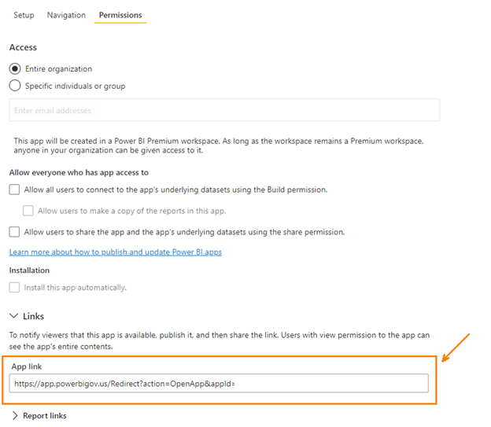

## Update Azure app registrations

1.  Navigate to the URL: <https://portal.azure.com/> and select "Azure Active Directory" in the navigation bar.


 

2.  Go to App Registrations and select Owned Applications

 

3.  Select the App you wish to update and then click on the navigation item labeled "API Permissions".

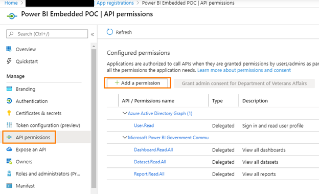 

> ***Important Note**: Make sure to search under \'APIs my organization uses\' and if you are updated Power BI API permissions please use the one labeled "Microsoft Power BI Government Community Cloud" (as shown below).  If you use the API permissions associated with "Power BI Service" this is for the commercial cloud and will not work on the agency's tenant.*

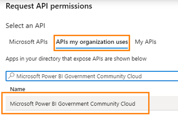 

Select \'Delegated permissions\' and select the required permission and click \'Add permissions. *Screenshot below is an example of adding permission to API for accessing Power BI App.*

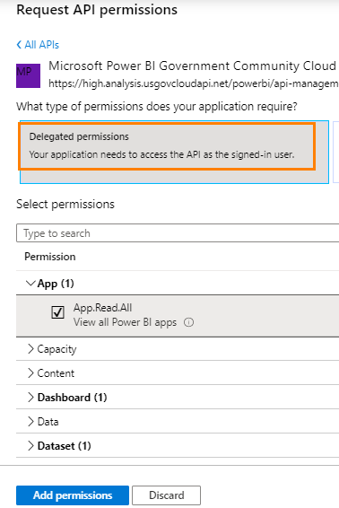
 
