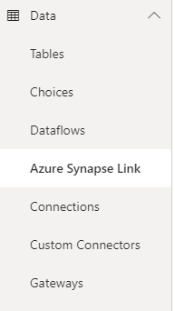
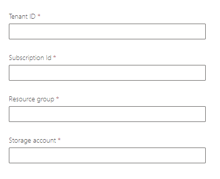

# Power Platform Azure Synapse Link Integration
To date (9/3/2021), this feature is only supported in GCC.  This will eventually land in our GCC High and DoD clouds as well.

## GCC

You have two implementation options to integrate Power Platform Dataverse tables with Azure Synapse Link.  

Option 1 is to use an Azure Commercial subscription that is associated to the same tenant as your O365 subscription.  Option 2 is to use an Azure for Government subscription.

### Azure Commerical Subscription
Below is an architecture diagram of how everything is laid out with this setup,


If you have an associated Azure Commerical subscription with your tenant, then you can follow the commerical public docs to set this up,

https://docs.microsoft.com/en-us/powerapps/maker/data-platform/azure-synapse-link-synapse

### Azure for Government Subscription

Below is an architecture diagram of how everything is laid out in this setup,


### Setup Notes for Azure for Government

First you need to have at least Application Administer priviledges to create a new Service Principal.  Use the PowerShell script below in your Azure for Government subscription to provision the "Export to data lake" service principal account.

```powershell
# Authenticate to Azure
Connect-AzAccount -Environment AzureUSGovernment 

# Provision the "Export to data lake" Service Principal account
New-AzADServicePrincipal -ApplicationId '7f15f9d9-cad0-44f1-bbba-d36650e07765' 
```

Now you need to create an Azure Storage account (Gen 2).

Make sure you mark "Enable hierarhical namespace" in the advanced section.


Once provisioned, you need to grant the "Export to data lake" service principal the following role assignments in IAM,

* Owner
* Storage Account Contributor
* Storage Blob Data Contributor
* Storage Blob Data Owner

Open up the Marker Portal in GCC (https://make.gov.powerapps.us) and select the environment you wan to setup.

Add the following query string ```?athena.advancedSetup=true``` to the end of the url.  For example,

```
https://make.gov.powerapps.us/environments/aaaaaa-xxx-4442-8f7e-229b080exxx/exporttodatalake?athena.advancedSetup=true
```

Click on the Azure Synapse Link menu item



Click on "New link to data lake"

Fill out the following fields,



Select next.  Choose the dataverse tables you want to sync and finish the setup.

Note.  If you get an error that a filesystem name does not exist, you may need to manually create the storage container via the Azure Portal.


Once that is working, you can optionally provision Azure Synapse Analytics using the already configured Azure Storage account.