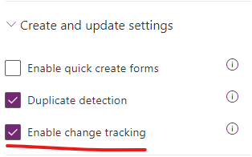
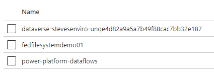
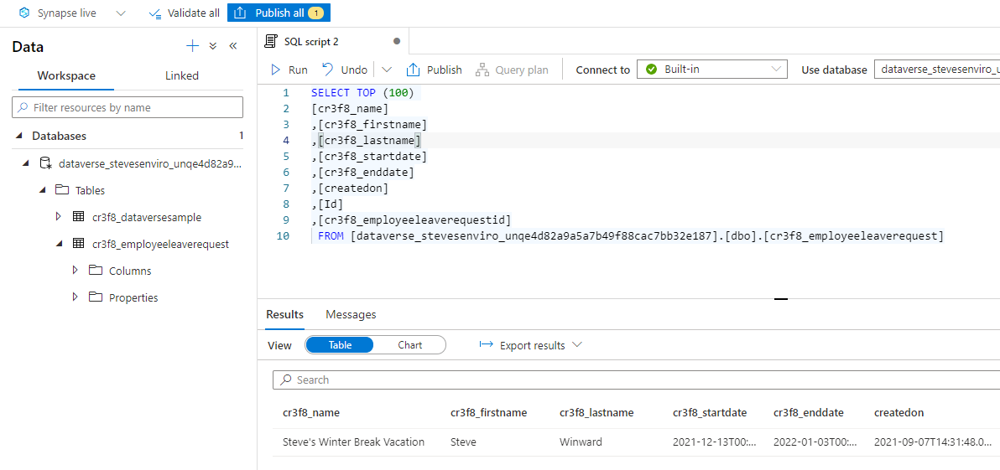
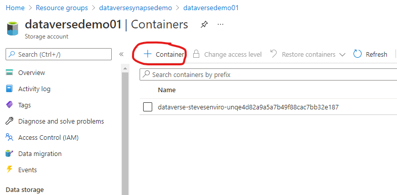

# Power Platform Azure Synapse Link Integration
> To date (9/3/2021), this feature is only supported in GCC.  This will eventually land in our GCC High and DoD clouds as well.

## Overview of the Feature
Azure Synapse integration with Power Platform Dataverse allows you to sync data automatically from select tables in Dataverse into an Azure Data Lake Storage Account.  Below is an example of how it works once Azure Synapse Link is already setup.  Full setup notes for GCC are included below.

1. Make sure the Dataverse table you want to sync is marked to enable change tracking.



2. Go to the Azure Synapse Link page and then lookup the Dataverse table you want to sync


3. Once configured, the Dataverse table will do an initial synchronization and then all future updates will get pushed to Azure Data Lake Storage


4. When you view the configured Azure Storage account you will see new containers provisioned by the Power Platform service,



5. When you drill into an environment's container you will then see all tables that are actively being synchronized.


6. Drilling into the tables container you will see a series of CSV files that contain the Dataverse data.


7. And if you open up one of the CSV files, you can see the actual contents which in this case matches the initial form submission in Power Apps.


8. Optionally, you can create an Azure Synapse Workspace that is associated with the Azure Data Lake Storage account.  This allows you to query with familiar SQL queries against all Dataverse data being synchronized!



## GCC Setup

You have two implementation options to integrate Power Platform Dataverse tables with Azure Synapse Link.  

Option 1 is to use an Azure Commercial subscription that is associated to the same tenant as your O365 subscription.  Option 2 is to use an Azure for Government subscription.

### Azure Commercial Subscription
Below is an architecture diagram of how everything is laid out with this setup,


If you have an associated Azure Commercial subscription with your tenant, then you can follow the commercial public docs to set this up,

[Azure Synapse Link Setup Documentation](https://docs.microsoft.com/en-us/powerapps/maker/data-platform/azure-synapse-link-synapse)

### Azure for Government Subscription

Below is an architecture diagram of how everything is laid out in this setup,


### Setup Notes for Azure for Government

> Important: you need to have at least Application Administrator privileges to create a new Service Principal. Global Administrator would work as well.  

Use the PowerShell script below in your Azure for Government subscription to provision the "Export to data lake" service principal account.

```powershell
# Authenticate to Azure for Government
Connect-AzAccount -Environment AzureUSGovernment 

# Provision the "Export to data lake" Service Principal account
New-AzADServicePrincipal -ApplicationId '7f15f9d9-cad0-44f1-bbba-d36650e07765' 
```

Next you need to create an Azure Storage account (Gen 2).


Make sure you mark "Enable hierarchical namespace" in the advanced section.


Once provisioned, you need to grant the "Export to data lake" service principal the following role assignments in IAM,

* Owner
* Storage Account Contributor
* Storage Blob Data Contributor
* Storage Blob Data Owner

Open up the Marker Portal in GCC (https://make.gov.powerapps.us) and select the environment you want to setup.

Click on the Azure Synapse Link menu item


Add the following query string ```?athena.advancedSetup=true``` to the end of the URL and load the page.  For example,

```
https://make.gov.powerapps.us/environments/aaaaaa-xxx-4442-8f7e-229b080exxx/exporttodatalake?athena.advancedSetup=true
```

Click on "New link to data lake"


Fill out the following fields,


Select next.  Choose the Dataverse tables you want to sync and finish the setup.

> If you get an error that a file system name does not exist, you may need to manually create the storage container via the Azure Portal.



Once that is working, you can optionally provision Azure Synapse Analytics using the already configured Azure Storage account.
